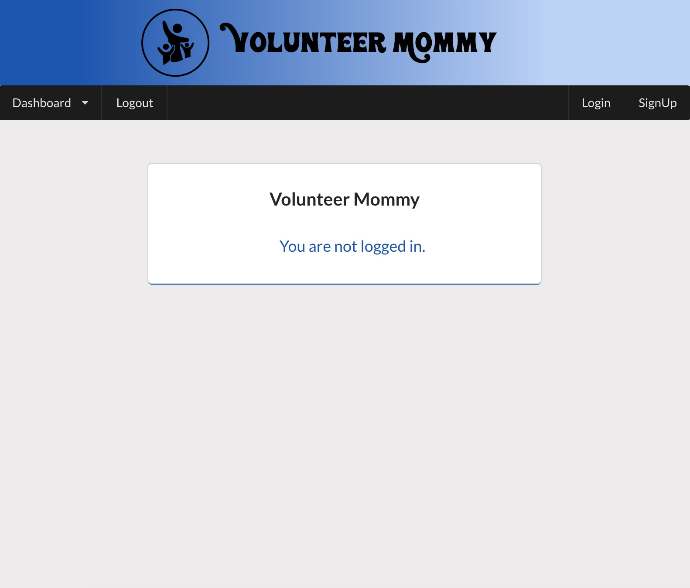
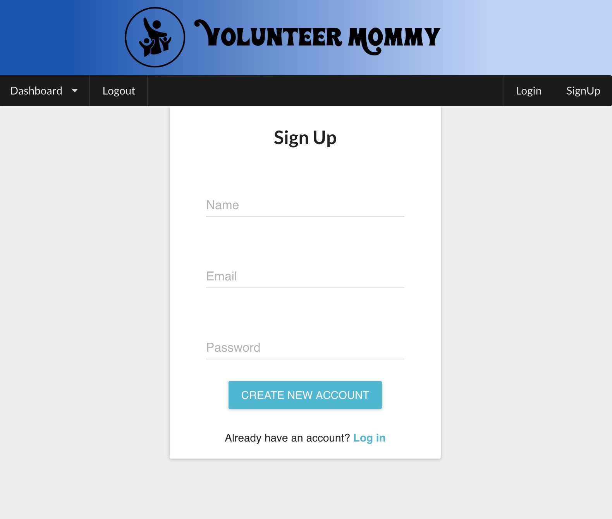
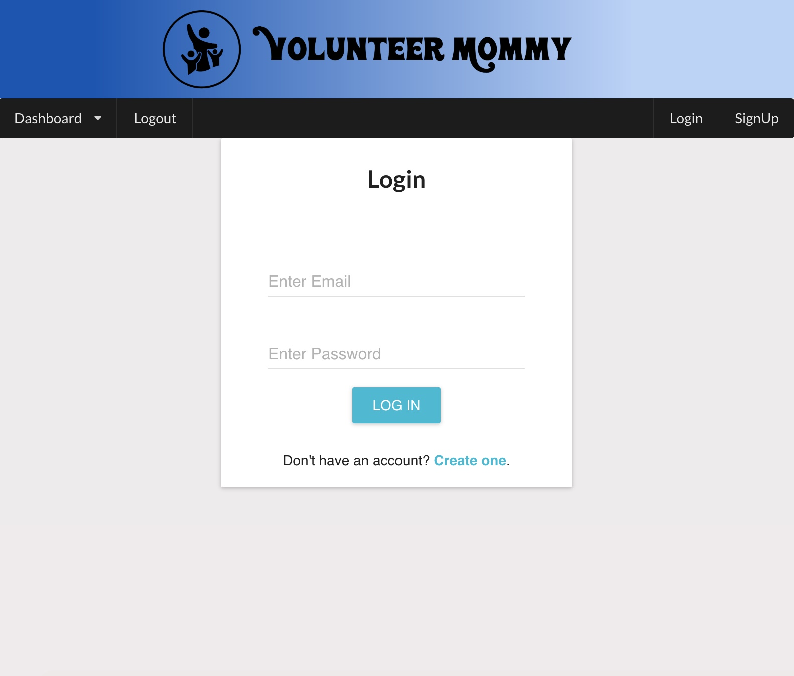
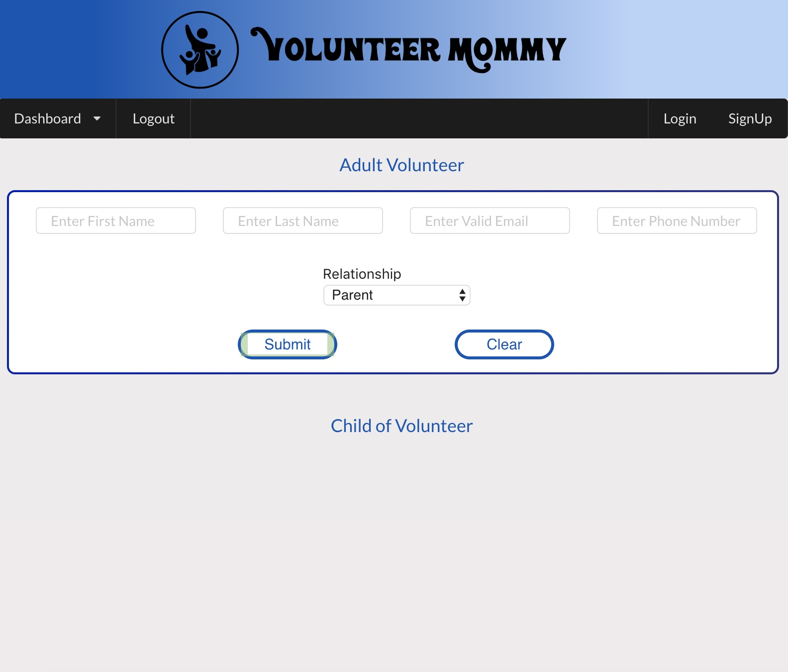
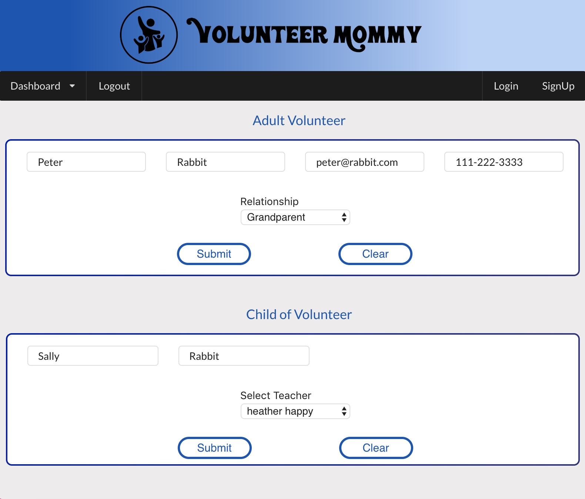
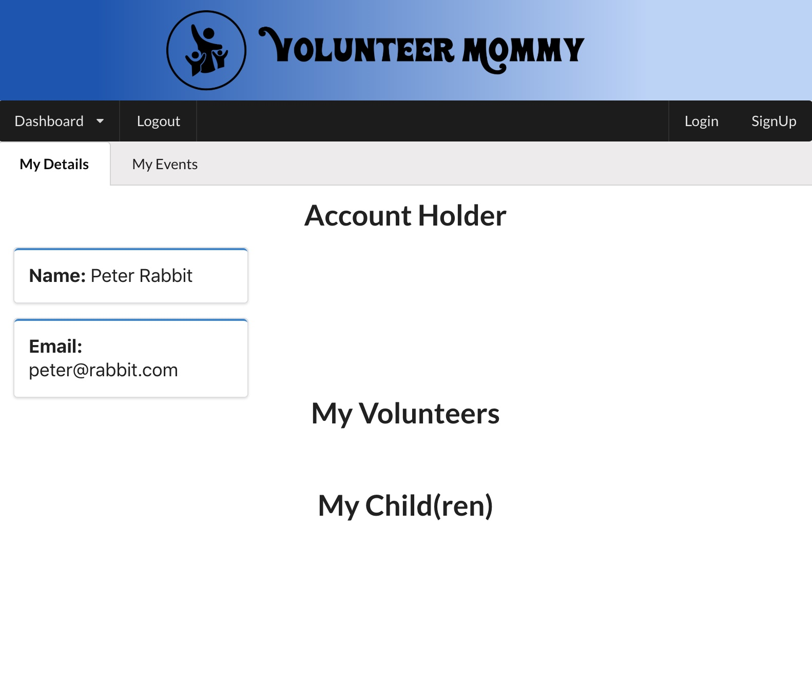

# Volunteer Mommy

An independent final project for a Full Stack Web Development Bootcamp.

## Project Description

This is an application designed to simplify the management of parent volunteers for a pre-school with the following features:

- Secure account creation to maintain contact details (email and phone number).

- Authenticated log-in and dashboard access.

- Ability to add adult family members as volunteers.

- Ability to add enrolled child(ren)

- Ability to select enrolled child(s) assigned teacher.

- Access to  `My Details` page to view details for registered account holder. 

The attached images illustrate the application:

## Dependencies 

The following applications need to be installed in order to run the Momentum.clone app.

- Mongo
- Express
- React
- Node.js
- yarn

# Getting Started
To start this project clone a copy of the project repository from Github onto your machine.  Once the repository is cloned run `yarn install` in the root directory.  

Then install the additional Node packages below: 

- yarn:
    * express
    * mongoose
    * mongoose-validator
    * passport.js
    * jsonwebtoken

Once completed run `yarn start`.

# Deployment
The project is deployed with Heroku.
- Heroku add-ons:  mLab MongoDB

# Code Structure

## Client
- build
- public

- src:
    * assets: 
        - images and logo

    * components
        - Header
        - Button
        - Dashboard
        - Input
        - Loginform
        - MyChildren
        - MyVolunteers
        - Routes
        - Select
        - SelectTeacher
        - SignUpForm
        - Tabs
        - UserProfile

    * containers
        - AdultContainer
        - ChildContainer
        - VolunteerRegistration

    * css
        - AdultContainer
        - App
        - ChildContainer
        - dashboard
        - header
        - homepage
        - index
        - loginform
        - mydetails
        - reset
        - signupform
        - userprofile

    * pages
        - Events
            * Event
            * NewEvent
        - MyAccount
            * MyAccount
            * MyDetails
            * MyEvents
        - DashboardPage
        - HomePage
        - LoginPage
        - LogoutFunction
        - Search
        - SignUpPage
        - Volunteers

    * Utils
        - APIs
        - Auth
    
    * App.js
    * App.test.js
    * index.js
    * serviceWorker.js

- other:
    * package.json
    * README
    * yarn.lock

## Root

- config
    * index.json

- middleware
    * auth-check.js

- models
    * Adult.js
    * Child.js
    * index.js
    * Teacher.js
    * User.js

- passport
    * local-login.js
    * local-signup.js

- routes
    * api-routes-adult.js
    * api-routes-child.js
    * api-routes-teacher.js
    * api-routes-user.js
    * api.js
    * auth.js

- Other
    * node_modules
    * .gitignore
    * package.json
    * server.js
    * README_deliverables
    * README
    * yarn.lock

# Author
- Kyla Middleton