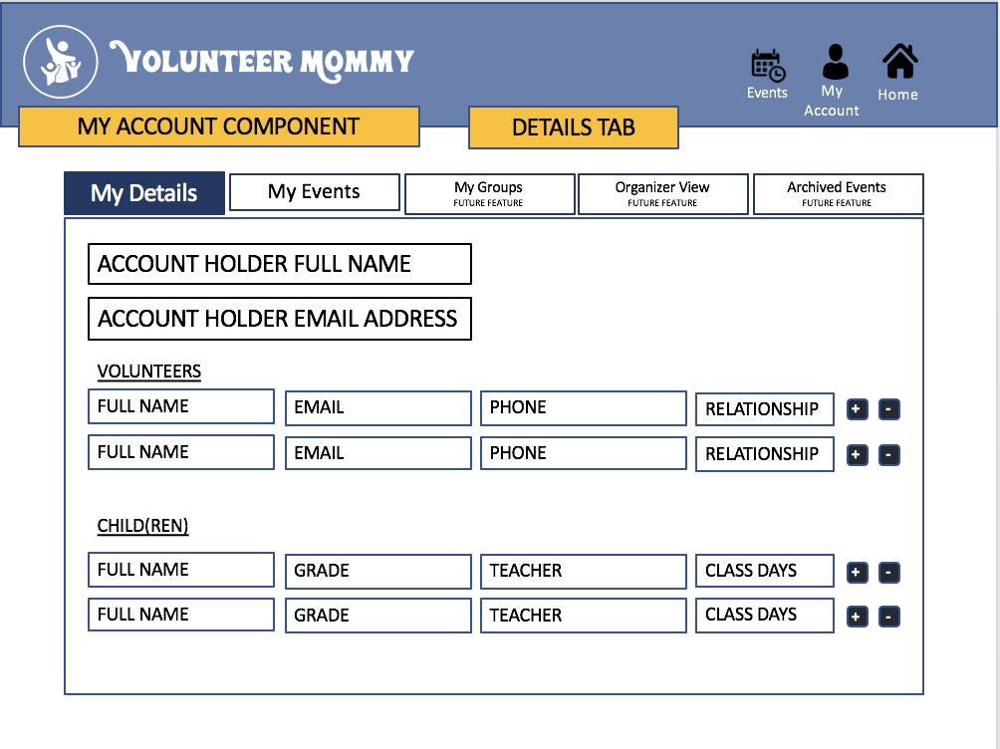

# volunteermommy

## Scope

Create an application to automate the process of scheduling preschool parent volunteers.  The application will allow users to register as a volunteer with the ability to add additional adult family members (spouse, aunts, uncles, grandparents, childcare provider, etc).  Users will also be able to create a profile for a child or children enrolled in the preschool.  

## MVP

1. As a user, I want to be able to add and/or delete adult family members as a school volunteer.  

2. As a user, I want to be able to and and/or delete a child or children enrolled in the school. 

## Additonal Functionality

3. As a user, I want to create an account and register as a school volunteer.

4. As a user, I want to sign up as a volunteer for a school event. 

5. As a user, I want to view all upcoming events. 

6. As a user, I want to view all events I've signed up to be a volunteer.

7. As an admin, I want to view a list of all registered volunteers. 

8. As an admin, I want to view an event with a list of registered volunteers. 

### Project Design MVP

Landing Page

Create Account View

New Volunteer

My Account

### Project Design Future Components

Login 

Create Event 

Events View

My Events View

## Deliverables

### Day 1
1. Decide on a final project. 
2. Pick a name for your application.
3. Create a mockup for the application and determine MVP requirements.  
4. Create a repository. 
5. A heroku deployment.
6. Create user stories.
7. Create and assign issues. 
8. Create a Kanban board. 

### Day 2
1. Create all database models.
2. Set up a get, post, put, and delete route for all resources.

### Day 3
3. Seed the database if needed.
4. Code functionality.

###Final
4. Style application.
5. Manage deployment. 

 

Icons made by <a href="https://www.flaticon.com/authors/simpleicon" title="SimpleIcon">SimpleIcon</a> from <a href="https://www.flaticon.com/" 			    title="Flaticon">www.flaticon.com</a> is licensed by <a href="http://creativecommons.org/licenses/by/3.0/" 			    title="Creative Commons BY 3.0" target="_blank">CC 3.0 BY</a>
